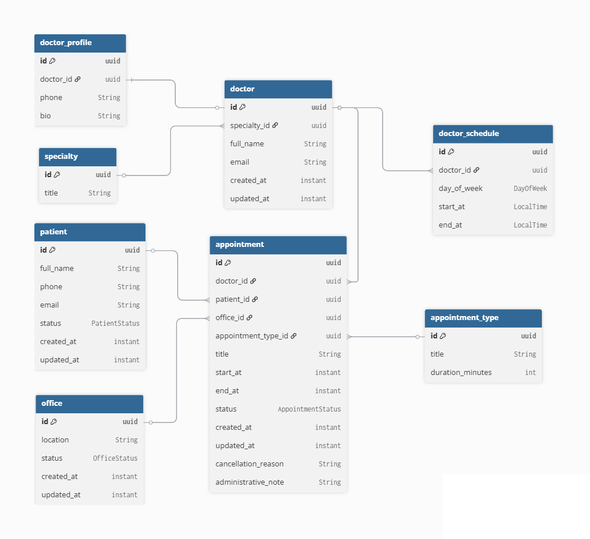

# Sistema de Reservas de Consultorios Universitarios

API REST desarrollada con Spring Boot para la gestión de citas médicas en un entorno universitario.

Permite administrar pacientes, doctores, especialidades, consultorios, tipos de cita, horarios y reservas médicas.

---

## Tecnologías utilizadas

- Java 21  
- Spring Boot 4  
- Spring Data JPA  
- PostgreSQL  
- Testcontainers  
- JUnit 5  
- Mockito  

---

## Arquitectura

- entities  
- dtos  
- mappers  
- repositories  
- services  
- exceptions  

---

## Modelo de datos

- Patient  
- Doctor  
- Specialty  
- Office  
- AppointmentType  
- DoctorSchedule  
- Appointment  

---

## Diagrama entidad-relación

---

## Testing

- Repository (Testcontainers)  
- Service (Mockito + JUnit)  

---

## Autor

Oscar Turizo
